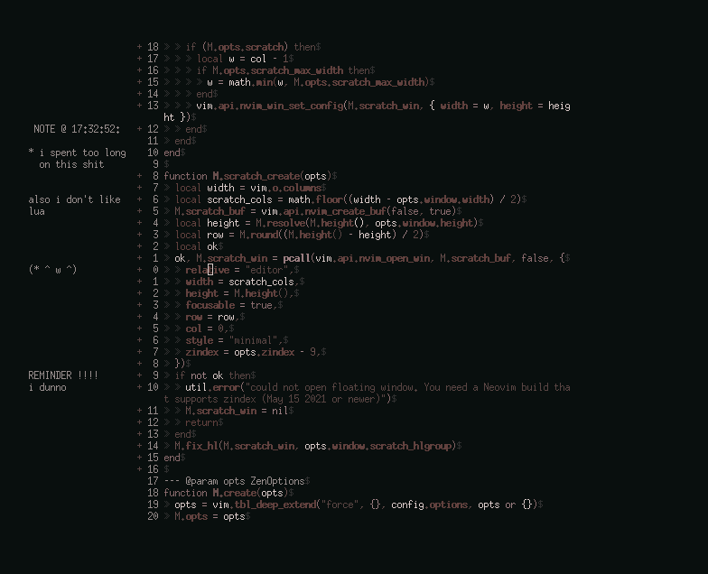

## Scratchy Zen Mode



This plugin is a fork of folke's [zen-mode.nvim](https://github.com/folke/zen-mode.nvim) that implements
the great idea of FraserLee's [ScratchPad](https://github.com/FraserLee/ScratchPad).

It turns the left margin added by Zen Mode into a scratch buffer (`:h scratch`)
that can be used like a sticky note for the duration of your time in `:ZenMode`.

Unlike ScratchPad, this scratch buffer is not persistent and should be treated
as a mechanism for ephemeral brainstorming. Since the window is an ordinary
vim scratch window you can save it manually if desired with `:w filename.txt`.

The documentation for folke's zen-mode.nvim (sans emotes) can be found
[below](#zen-mode). I make no promises that this repo will necessarily be
maintained and/or kept up to date with `zen-mode.nvim`. Use with caution.

### Scratch-Specific Configuration

Only a few options were added to `zen-mode.nvim` for configuring this feature:

```lua
require("zen-mode").setup {
  scratch = true,
  scratch_max_width = nil,
  window = {
    scratch_hlgroup = "ZenScratch",
  },
}
```

* `scratch` enables or disables the scratch pad feature entirely (default:
**true**)

* `scratch_max_width` specifies how wide the scratch pad window can be. this
allows you to limit the width of the scratch pad while not affecting the
overall Zen Mode width. When unset the scratch window will use the entire
left-side margin of the Zen Mode background, minus one column (default: **nil**)

* `scratch_hlgroup` specifies the highlight group to apply to the scratch pad
window. Allows you to set the scratch pad to an existing group (e.g. `"Comment"`)
or modify the default group (default: **"ZenScratch"**)

### Navigating to the Scratch Window

[Since Zen Mode will close if the cursor leaves the main window (or scratch
window in this fork)](https://github.com/lilibyte/scratchy-zen-mode.nvim/blob/7fbc90400b68ebde0d4ab83eaa51aab717dc29f3/lua/zen-mode/view.lua#L300-L313)
and because both windows are floating windows (`:h api-floatwin`) it makes
navigating between them a little tricky. As a mitigation for this issue I
created some functions that can be used to move the cursor between the two
windows.

* [`require("zen-mode").to_scratch()`](https://github.com/lilibyte/scratchy-zen-mode.nvim/blob/7fbc90400b68ebde0d4ab83eaa51aab717dc29f3/lua/zen-mode/view.lua#L38-L45)
will move the scratch pad window into focus
if it's available (Zen Mode is activated and `scratch` is truthy) and return
`true`, and otherwise will return `false`

* [`require("zen-mode").to_zen()`](https://github.com/lilibyte/scratchy-zen-mode.nvim/blob/7fbc90400b68ebde0d4ab83eaa51aab717dc29f3/lua/zen-mode/view.lua#L29-L36)
will move the main Zen Mode window into focus if it's available (Zen Mode is
activated) and return `true`, and otherwise will return `false`

* [`require("zen-mode").is_scratch_open()`](https://github.com/lilibyte/scratchy-zen-mode.nvim/blob/7fbc90400b68ebde0d4ab83eaa51aab717dc29f3/lua/zen-mode/view.lua#L21-L27)
will return `false` if Zen Mode is not activated, and otherwise will return the
value of the `scratch` option; this can be used along with the original
`zen-mode.nvim` function
[`.is_open()`](https://github.com/lilibyte/scratchy-zen-mode.nvim/blob/7fbc90400b68ebde0d4ab83eaa51aab717dc29f3/lua/zen-mode/view.lua#L17-L19)
to check if cursor movement would be valid without moving the cursor

To demonstrate, here's the modification I made to my personal config file to
accommodate this plugin:

```lua
" nnoremap <silent> <C-h> <C-w>h
" nnoremap <silent> <C-l> <C-w>l
lua << EOF
local function t(str)
    return vim.api.nvim_replace_termcodes(str, true, true, true)
end

function _G.go_left_win()
    return require("zen-mode").to_scratch() or vim.fn.feedkeys(t"<C-w>h")
end

function _G.go_right_win()
    return require("zen-mode").to_zen() or vim.fn.feedkeys(t"<C-w>l")
end

vim.api.nvim_set_keymap('n', '<C-h>', "<cmd>lua _G.go_left_win()<CR>", {noremap = true})
vim.api.nvim_set_keymap('n', '<C-l>', "<cmd>lua _G.go_right_win()<CR>", {noremap = true})
EOF

nnoremap <silent> <C-j> <C-w>j
nnoremap <silent> <C-k> <C-w>k
```

## Zen Mode

Distraction-free coding for Neovim >= 0.5

### Features

- opens the current buffer in a new full-screen floating window
- doesn't mess with existing window layouts / splits
- works correctly with other floating windows, like LSP hover, WhichKey, ...
- you can dynamically change the window size
- realigns when the editor or Zen window is resized
- optionally shade the backdrop of the Zen window
- always hides the status line
- optionally hide the number column, sign column, fold column, ...
- highly customizable with lua callbacks `on_open`, `on_close`
- plugins:
  - disable gitsigns
  - hide [tmux](https://github.com/tmux/tmux) status line
  - increase [Kitty](https://sw.kovidgoyal.net/kitty/) font-size
- **Zen Mode** is automatically closed when a new non-floating window is opened
- works well with plugins like [Telescope](https://github.com/nvim-telescope/telescope.nvim) to open a new buffer inside the Zen window
- close the Zen window with `:ZenMode`, `:close` or `:quit`

### Requirements

- Neovim >= 0.5.0
  - **Zen Mode** uses the new `z-index` option for floating windows
  - only builds **newer than May 15, 2021** are supported
- [Twilight](https://github.com/folke/twilight.nvim) is optional to dim inactive portions of your code

### Installation

Install the plugin with your preferred package manager:

#### [packer](https://github.com/wbthomason/packer.nvim)

```lua
-- Lua
use {
  "folke/zen-mode.nvim",
  config = function()
    require("zen-mode").setup {
      -- your configuration comes here
      -- or leave it empty to use the default settings
      -- refer to the configuration section below
    }
  end
}
```

#### [vim-plug](https://github.com/junegunn/vim-plug)

```vim
" Vim Script
Plug 'folke/zen-mode.nvim'

lua << EOF
  require("zen-mode").setup {
    -- your configuration comes here
    -- or leave it empty to use the default settings
    -- refer to the configuration section below
  }
EOF
```

### Configuration

**Zen Mode** comes with the following defaults:

```lua
{
  window = {
    backdrop = 0.95, -- shade the backdrop of the Zen window. Set to 1 to keep the same as Normal
    -- height and width can be:
    -- * an absolute number of cells when > 1
    -- * a percentage of the width / height of the editor when <= 1
    -- * a function that returns the width or the height
    width = 120, -- width of the Zen window
    height = 1, -- height of the Zen window
    -- by default, no options are changed for the Zen window
    -- uncomment any of the options below, or add other vim.wo options you want to apply
    options = {
      -- signcolumn = "no", -- disable signcolumn
      -- number = false, -- disable number column
      -- relativenumber = false, -- disable relative numbers
      -- cursorline = false, -- disable cursorline
      -- cursorcolumn = false, -- disable cursor column
      -- foldcolumn = "0", -- disable fold column
      -- list = false, -- disable whitespace characters
    },
  },
  plugins = {
    -- disable some global vim options (vim.o...)
    -- comment the lines to not apply the options
    options = {
      enabled = true,
      ruler = false, -- disables the ruler text in the cmd line area
      showcmd = false, -- disables the command in the last line of the screen
    },
    twilight = { enabled = true }, -- enable to start Twilight when zen mode opens
    gitsigns = { enabled = false }, -- disables git signs
    tmux = { enabled = false }, -- disables the tmux statusline
    -- this will change the font size on kitty when in zen mode
    -- to make this work, you need to set the following kitty options:
    -- - allow_remote_control socket-only
    -- - listen_on unix:/tmp/kitty
    kitty = {
      enabled = false,
      font = "+4", -- font size increment
    },
  },
  -- callback where you can add custom code when the Zen window opens
  on_open = function(win)
  end,
  -- callback where you can add custom code when the Zen window closes
  on_close = function()
  end,
}
```

### Usage

Toggle **Zen Mode** with `:ZenMode`.

Alternatively you can start **Zen Mode** with the `Lua` API and pass any additional options:

```lua
require("zen-mode").toggle({
  window = {
    width = .85 -- width will be 85% of the editor width
  }
})
```

### Inspiration

- Visual Studio Code [Zen Mode](https://code.visualstudio.com/docs/getstarted/userinterface#_zen-mode)
- Emacs [writeroom-mode](https://github.com/joostkremers/writeroom-mode)
